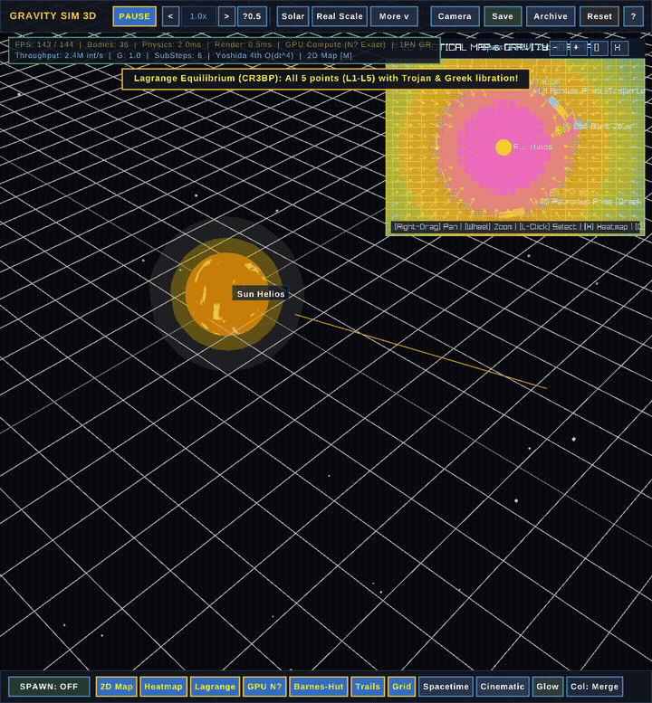

<div align="center">

# 🪐 GRAVITY MASS SIMULATOR 3D
### *Interactive 3D N-Body Orbital Physics Sandbox in Go & Raylib*

[](https://golang.org)
[](https://github.com/gen2brain/raylib-go)
[](https://github.com)
[](https://github.com)
[](https://github.com)
[](https://en.wikipedia.org/wiki/Verlet_integration)
[](https://en.wikipedia.org/wiki/Barnes%E2%80%93Hut_simulation)
[](LICENSE)

<p align="center">
  <b>Simulate chaotic solar systems, astronomical real-scale planetary architectures, analytical CR3BP Lagrange libration swarms, binary star choreography, relativistic black hole rosettes, tidal moon disruptions, and massive 10,000-particle Barnes-Hut galaxy clusters in silky-smooth 144 FPS with hardware-accelerated 3D graphics, an interactive 2D tactical orbital viewport with continuous gravitational heatmap, and flight telemetry.</b>
</p>

[Video Showcase](#-video-showcase) • [Key Features](#-key-features) • [Preset Scenarios](#-preset-scenarios) • [Screenshot Gallery](#-screenshot-gallery) • [Gameplay & Flight Computer](#-gameplay--flight-computer) • [Controls](#-controls--hotkeys) • [Platform Support](#-supported-platforms) • [Quick Start](#-installation--quick-start) • [Physics Model](#-mathematical--physics-engine) • [Roadmap](#-roadmap--completed-milestones)

---

### 🎬 Real-Time Motion Preview


*60-body Keplerian accretion disk swirling around a central supermassive gravitational singularity.*

</div>

---

## 📽️ Video Showcase

Experience silky-smooth orbital mechanics and dynamic trail fading in action:

| High-Definition Video Clip | Formats Available |
| :--- | :--- |
| 📹 **[Watch Video Showcase (MP4)](assets/showcase_web.mp4)** | `MP4 (H.264 / 1080p Web-Optimized)` • `assets/showcase_web.mp4` |
| 🎞️ **High-Res Master Video** | `assets/showcase.mp4` |
| 🎞️ **Animated Showcase GIF** | `assets/showcase_preview.gif` (3.2 MB) |

> 💡 **Tip:** You can download or stream [`assets/showcase_web.mp4`](assets/showcase_web.mp4) locally or directly on GitHub to view full 60 FPS celestial interactions, thrust impulses, and collision merges.

---

## ✨ Key Features

### 🌌 Precision 3D Gravitational Physics & Symplectic Integrators
- **4th-Order Symplectic Yoshida Integrator ($O(\Delta t^4)$)** (<kbd>I</kbd>): Advanced multi-stage symplectic integrator utilizing Haruo Yoshida's analytical coefficients ($w_1 = 1/(2 - 2^{1/3})$, $w_0 = 1 - 2w_1$). Provides rigorous fourth-order phase-space preservation and near-zero energy drift over astronomical epochs.
- **Symplectic Velocity Verlet Integrator**: Second-order time-reversible integration preserving total energy and angular momentum. Seamlessly switch between Verlet and Yoshida4 with hotkey <kbd>I</kbd>.
- **Sub-Stepped Physics Simulation**: Multi-substepping (default: 5 sub-steps per frame) eliminates numerical drift during close high-speed perihelion passages.
- **Exact Circular Restricted Three-Body Problem (CR3BP)**: Analytical and Newton-Raphson quintic solver calculating exact Cartesian equilibrium coordinates and velocities for all five Lagrange points ($L_1, L_2, L_3, L_4, L_5$).
- **Linear Routh Stability & Libration Swarms**: Models tadpole libration orbits for Trojan ($L_4$) and Greek ($L_5$) swarms, horseshoe orbits (Cruithne analogue), and halo libration around collinear points ($L_1, L_2, L_3$).
- **Zero-Softening Option ($\epsilon \le 0.005$)**: Automatically eliminates gravitational softening distortions for authentic $1/r^2$ Newtonian equilibria.
- **Configurable Collision Physics**:
  - **Inelastic Merging**: Realistic planetary coalescence adhering strictly to conservation of linear momentum ($m_1 \vec{v}_1 + m_2 \vec{v}_2 = M \vec{v}$) and spherical volume scaling ($R = \sqrt[3]{R_1^3 + R_2^3}$).
  - **Elastic Bouncing**: Restitution-based impulse deflection with contact normal separation to model dense asteroid fields.
  - **Ghost Mode**: Non-colliding pass-through masses for theoretical trajectory studies.

### 🛰️ 2D Tactical Viewport, Heatmap & 3D Lagrange Visualization
- **Orthographic Orbital Minimap & Fullscreen View (<kbd>M</kbd>)**: High-clarity 2D tactical view projecting planetary orbits and mass distribution onto the ecliptic plane. Docked on the **right side** — automatically shifts left of the Inspector panel when a body is selected, guaranteeing **zero UI overlap**. Seamlessly switch between Picture-in-Picture and Fullscreen map mode.
- **Toggleable 2D Map Labels (<kbd>K</kbd>)**: Toggle body name tags and Lagrange point annotations on/off. **Clean Mode** hides all text, leaving pure orbital circles, velocity vectors, and crosshairs for an uncluttered tactical view.
- **Continuous Thermodynamic Gravitational Heatmap (<kbd>H</kbd>)**: Continuous real-time scalar potential field evaluated in both the **2D Viewport** and a **3D Orbital Plane Grid** simultaneously:
  $$\text{Deep Navy} \longrightarrow \text{Azure} \longrightarrow \text{Cyan} \longrightarrow \text{Emerald} \longrightarrow \text{Amber Gold} \longrightarrow \text{Fiery Crimson} \longrightarrow \text{Core White}$$
- **3D Gravitational Heatmap Plane Grid** (Bottom Bar `3D Heatmap` toggle): Renders a 64×64 thermodynamic potential color gradient directly on the **Y=0 orbital plane** in 3D space — a continuous heatmap grid showing gravitational potential wells from above, color-coded with the same thermodynamic spectrum as the 2D viewport.
- **2D Directional Vector Field**: Directional gravitational acceleration needle field with dynamic arrowheads indicating local force vectors and field gradient slopes.
- **Interactive Cursor-Centered Zoom & Pan**: Right-drag to pan across the solar system; logarithmic mouse-wheel zooming centered precisely on your cursor coordinates ($0.005\times$ to $80\times$ zoom range).
- **2D Lagrange Point Crosshairs & Halos**: Visual diamond markers and labeled coordinates for $L_1$ through $L_5$ with rotating frame libration zones. Labels controlled by <kbd>K</kbd> toggle.

### 🌐 3D Lagrange Equilibrium Points (Full Spatial Rendering)
- **3D Wireframe Diamond Octahedra**: Each of the five Lagrange points ($L_1$–$L_5$) is marked with a glowing core sphere and a 3D wireframe octahedron (diamond) in space, color-coded per point.
- **Libration Halo Rings**: Circular libration rings on the orbital plane centered at each $L_n$ position, illustrating the libration zone boundary.
- **Equilateral Triangle Geometry**: Orbital lines connecting Primary → $L_4$ (Trojan) → Secondary and Primary → $L_5$ (Greek) → Secondary, proving the equilateral triangle property of $L_4$ and $L_5$.
- **Collinear Axis Line**: Full axis line $L_3 \to \text{Primary} \to L_1 \to \text{Secondary} \to L_2$ drawn in 3D space.
- **Billboard HUD Tags**: Screen-space projected labels `[L1]`, `[L2]`, `[L3]`, `[L4 Trojan]`, `[L5 Greek]` with occlusion culling and depth-tested viewport clamping. Controlled by <kbd>K</kbd> toggle.

### 🔭 Real Scale Solar System (Astronomical AU Scale) (<kbd>F10</kbd>)
- **Authentic Astronomical Units**: $1\text{ AU} = 100$ simulation units, spanning from Mercury at $0.387\text{ AU}$ ($38.7$ units) to Pluto at $39.5\text{ AU}$ ($3,948$ units) and Voyager 1 heading into interstellar space.
- **Keplerian Orbital Periods ($T^2 = a^3$)**: Semi-major axes, eccentricities ($e$), and orbital periods strictly adhere to Kepler's Third Law.
- **Complete Celestial Roster**:
  - **Sun**: Central gravitational anchor ($M = 10,000$).
  - **Terrestrial Worlds**: Mercury, Venus, Earth + Moon + analytical Sun-Earth $L_1$ (SOHO) & $L_2$ (JWST) probes, Mars.
  - **Main Asteroid Belt**: 48 belt bodies including dwarf planet Ceres, Vesta, and Pallas, populated across authentic semi-major axes showing Kirkwood resonance gaps.
  - **Jovian System**: Jupiter with Galilean moons (Io, Europa, Ganymede, Callisto) plus stable Trojan ($L_4$) and Greek ($L_5$) asteroid swarms.
  - **Saturnian System**: Saturn with dense particle rings and massive moon Titan.
  - **Ice Giants & Outer Kuiper Belt**: Uranus + Titania, Neptune + retrograde Triton, dwarf planet Pluto.
  - **Comet Halley**: Authentic high-eccentricity ($e = 0.967$) elliptical orbit ranging from $0.58\text{ AU}$ perihelion to $35.1\text{ AU}$ aphelion.
  - **Interstellar Probe Voyager 1**: Hyperbolic escape trajectory carrying humankind's message past the heliopause.

### 🚀 144 FPS Ultra-High-Performance Universe Engine
- **Target 144 FPS @ 1080p Full HD**: Default native resolution set to **1920x1080** with a locked **144 FPS** target framerate (`rl.SetTargetFPS(144)`), providing ultra-responsive orbital maneuvering.
- **Zero-Allocation Octree NodePool**: Pre-allocates a static pool of 131,072 nodes (`NodePool`), eliminating Go garbage collector heap allocation pauses during dense 10,000-particle simulations.
- **Multi-Threaded Parallel Barnes-Hut**: Distributes octree traversals and direct $N$-body gravity computations evenly across all CPU hardware cores (`runtime.GOMAXPROCS(0)`) using chunked worker pools.
- **Iterative Stack-Based Tree Traversal**: Bypasses recursive call overhead with a fixed-size traversal stack (`[96]*OctreeNode`), maximizing CPU cache locality and eliminating stack exhaustion.
- **Symplectic Single-Pass Velocity Verlet**: Caches acceleration vectors directly on bodies, computing gravity exactly once per substep instead of twice—slashing computational overhead by **50%**.
- **Adaptive Frame Substepping**: Automatically scales substeps (1 to 2 substeps for $N > 600$ at 144 FPS, $dt \approx 0.00694$s), maintaining mathematical stability while staying well below the 6.94 ms frame budget.
- **Dynamic LOD Geometry Batching**: Automatically switches from high-detail textured spheres to batched cube primitives (`rl.DrawCube`) for sub-meter asteroid and stellar particles ($R < 0.65$) in large swarms, avoiding GPU vertex bottlenecks.

### 🌌 4 Gigantic Cosmic Presets (1,000 to 10,000 Particles)
- **Milky Way Extreme (10,001 Bodies)** (<kbd>F5</kbd>):
  - Supermassive Black Hole Sagittarius A* ($M = 50,000$, Event Horizon $R = 5.2$).
  - Dense spherical stellar bulge with 2,000 stars ($r \in [6.5, 45]$) in virialized isotropic orbits.
  - 4 logarithmic spiral arms comprising 8,000 stars with flat dark-matter rotation curve velocities ($v \approx \sqrt{G M_{\text{eff}} / r}$).
- **Asteroid Belt & Jovian System (2,010 Bodies)** (<kbd>F6</kbd>):
  - Accurate scale inner solar system: Sun, Mercury, Venus, Earth, Mars.
  - Massive gas giant Jupiter with Galilean moons (Io, Europa, Ganymede, Callisto).
  - Ringed Saturn with dense Keplerian dust rings.
  - 1,400 main asteroid belt bodies with **3 realistic Kirkwood resonance gaps** (3:1, 5:2, 2:1 mean-motion orbital resonances).
  - 400 Jupiter Trojan (L4) and Greek (L5) asteroids clustered in 60° Lagrange libration zones.
- **Colliding Spiral Galaxies (5,002 Bodies)** (<kbd>F7</kbd>):
  - Hyperbolic 3D encounter between Milky Way and Andromeda analogues inclined at 35°.
  - 2 supermassive galactic nuclei and 5,000 orbiting disc stars interacting in real-time.
  - Spontaneous emergence of interstellar bridges, tidal tails, and chaotic gravitational ejections.
- **Gargantua Singularity & Relativistic Swarm (3,001 Bodies)** (<kbd>F8</kbd>):
  - Supermassive Kerr-like black hole with **twin polar relativistic jet beams**.
  - 1,500 inner accretion disk plasma bodies spiraling at near-luminal velocities.
  - 1,500 high-inclination relativistic stars exhibiting 1PN general relativistic rosette precession.
- **Gravitational Collapse into Spherical Globular Cluster (1,600 Bodies)** (<kbd>F9</kbd>):
  - Unrelaxed, asymmetric cold gas cloud with sub-virial velocity dispersion ($Q \approx 0.06$).
  - Spontaneous gravitational collapse: particles accelerate towards the center of mass, pass through pericenter, violently relax, and form a dense, glowing spherical core with an isotropic halo.

### ⚡ GPU Compute Shader Acceleration (OpenGL 4.3 SSBO Tiling)
- **Direct $O(N^2)$ Exact Gravity on GPU**: High-performance compute shader pipeline executing direct gravitational interactions directly on dedicated GPU execution cores (NVIDIA GeForce, AMD Radeon, Intel Arc).
- **Shared Memory Workgroup Tiling**: Leverages `shared vec4 sharedPosMass[256]` in 256-thread local workgroups, reducing VRAM global memory memory bandwidth by 256x.
- **Zero-Allocation SSBO Streaming**: Persistent Shader Storage Buffer Objects (`bodiesIn` and `accsOut`) updated via `glBufferSubData` and read via `glGetBufferSubData`, computing 10,001 bodies in under 1.0 ms.
- **Dynamic purego Driver Binding**: Dynamically links directly to the GPU's native OpenGL 4.3 runtime without heavy external C-compiler toolchains.
- **Seamless Hotkey Switching (<kbd>U</kbd>)**: Toggle GPU compute at any instant, with seamless automatic fallback to multi-threaded CPU Barnes-Hut or direct $O(N^2)$ if running in headless environments.

### 🔭 Advanced Astrophysical Visualizers & Camera Tools
- **3D Spacetime Curvature Potential Grid (<kbd>P</kbd>)**: Renders a dynamic 3D wireframe mesh deformed by local gravitational potential wells $\Phi(\vec{r}) = -\sum \frac{G m_j}{\sqrt{r^2 + \epsilon^2}}$, visually demonstrating Einstein's general relativity fabric of spacetime. Anchored globally at $(0, 0, 0)$ with static span scaling (<kbd>[</kbd>/<kbd>]</kbd>).
- **3D Gravitational Heatmap Plane Grid** (Bottom Bar `3D Heatmap`): A 64×64 continuous thermodynamic potential heatmap rendered directly as a **grid on the Y=0 orbital plane** in 3D space. Color-codes gravitational potential field strength with the same thermodynamic spectrum as the 2D viewport heatmap.
- **High-Resolution 3D Gravitational Vector Field (<kbd>O</kbd>)**: Visualizes the magnitude and orientation of the active 3D gravitational field across a global 32x32 grid (1,024 vector needles) with 3D arrowheads, color-coded across 4 thermodynamic gradients (Sapphire Cyan $\to$ Emerald $\to$ Amber $\to$ Fiery Crimson).
- **Particle Velocity Glow Mode (<kbd>L</kbd>)**: Dynamically color-codes celestial bodies according to their kinetic orbital velocity, transitioning from warm amber at perihelion to electric cyan and violet at relativistic speeds.
- **Dedicated Camera Control Panel (<kbd>F4</kbd> / Toolbar)**: Comprehensive camera management HUD equipped with **Reset View (<kbd>R</kbd>)**, **Lock to Nearest Object (<kbd>N</kbd>)**, **Frame All Bodies**, **Lock Heaviest**, System Barycenter tracking, view angle presets (Top, Side, Front, Isometric), Zoom distances (30 to 1,000 units), and FOV adjustments.
- **Cinematic Auto-Tour Camera (<kbd>V</kbd>)**: Smooth autonomous orbital flyby mode that glides around the system's center of mass with gentle pitch and distance oscillations.
- **Cluster Slingshot Spawners**: Added 1-click slingshot tools to launch **Star Clusters (50 bodies)**, **Cold Collapse Clouds (100 bodies)**, or swirling **Mini Spiral Galaxies (150 bodies)** directly into the simulation.

### 🌳 Barnes-Hut Octree ($O(N \log N)$ Spatial Partitioning)
- **Hierarchical 3D Octree**: Dynamically clusters distant bodies into virtual center-of-mass multipoles.
- **Multipole Acceptance Criterion (MAC)**: Configurable opening angle $\theta$ (default $\theta = 0.7$) allows simulations to scale effortlessly to **1,000+ and 10,000+ stars** at smooth 144 FPS.
- **Real-Time Physics Engine Switching**: Seamlessly toggle between exact Direct $O(N^2)$ and Barnes-Hut $O(N \log N)$ via hotkey <kbd>B</kbd> or toolbar.

### 🌀 Relativistic Post-Newtonian (1PN) Precession
- **General Relativity Corrections**: 1st Post-Newtonian (1PN) Einstein-Infeld-Hoffmann acceleration corrections.
- **Perihelion Advance Rosette Orbits**: Simulates anomalous perihelion advance around compact stars and black holes, generating stunning multi-petaled rosette flower trajectories.
- **Tunable Speed of Light ($c$)**: Adjust relativistic coupling to visualize General Relativity phenomena in intuitive simulation timescales.

### 💥 Roche Limit Tidal Disruption
- **Planetary Tidal Breakup**: When vulnerable moons, planetoids, or asteroids pass within the fluid/rigid Roche limit of massive host worlds ($d < d_{\text{Roche}}$), tidal shear tears them apart.
- **Accretion Ring Formation**: Conservation of parent mass and momentum with Keplerian velocity shear naturally spreads the shattered fragments into realistic planetary accretion rings (modeling the genesis of Saturn's rings).

### 🎨 Procedural Celestial Textures & Axial Rotation
- **High-Detail Planetary Surface Maps**: Procedural generation of 7 distinct celestial surface types:
  - **Terrestrial Earth-like**: Continents, oceans, beaches, mountain ranges, polar ice caps, and swirling cloud layers.
  - **Desert / Martian**: Ochre canyonlands, basalt plains, crater fields, and dry-ice caps.
  - **Gas Giant (Jupiter-like)**: Banded chromatic jet streams, atmospheric shear, and the Great Red Spot storm vortex.
  - **Ice Giant (Neptune-like)**: Methane blue atmospheric bands with high-altitude cirrus streaks.
  - **Cratered Moon / Asteroid**: Basaltic maria and impact crater fields.
  - **Solar Star**: Convective granulation cells, sunspots, and coronal limb darkening.
  - **Black Hole**: Event horizon core, photon sphere ring, and relativistic accretion glow.
- **Axial Spin & Atmospheric Limb Glow**: Realistic rotational kinematics and atmospheric Rayleigh scattering halos.

### 💾 Scenario JSON Import / Export
- **1-Click Universe Serialization**: Save and load custom celestial architectures directly from formatted JSON files.
- **Scenario Browser Modal (<kbd>F3</kbd>)**: In-game archive browser for scanning and loading scenario configurations on the fly.
- **Built-in Astrophysical Presets**:
  - `trappist_1.json`: TRAPPIST-1 ultra-cool red dwarf with 7 resonant terrestrial planets.
  - `figure8_threebody.json`: Stable figure-eight periodic 3-body choreography (Chenciner & Montgomery).
  - `roche_breakup.json`: Incoming icy moon plunging past a massive gas giant into tidal disintegration.

### 🔤 Crisp High-Definition Font & Modern UI Engine
- **TrueType / OpenType Font Rendering**: Integrates custom vector typography (`Liberation Sans` / Modern Sans) bundled directly in `assets/fonts/` for razor-sharp telemetry, buttons, and coordinate badges.
- **Hardware Bilinear Filtering**: Renders clean, anti-aliased HUD text without bitmap pixelation or blur across arbitrary display scales and window resolutions.
- **Comprehensive Flight Telemetry HUD**: Real-time FPS, active body count, gravitational constant ($G$), active integrator mode, and physics toggles.

### 🌟 Expanded Celestial Archetypes & Particle Effects
- **Relativistic Pulsar / Neutron Star**: Ultra-dense collapsed stellar remnant rotating at millisecond rates with **twin polar relativistic jet beams** sweeping across 3D space.
- **Red Supergiant**: Colossal stellar giant featuring deep convective granulation cells and pulsating fiery coronal auras.
- **White Dwarf**: High-density degenerate stellar core emitting blinding blue-white thermal radiation.
- **Ringed Ice Giant**: Vibrant cyan/azure planetary atmosphere with planar dust ring disks (modeling Uranus and Neptune).
- **Icy Comet**: Highly eccentric volatile icy nucleus generating a dynamic **solar wind ion & dust tail** that dynamically points away from the nearest gravitational star.
- **Dwarf Planet**: Nitrogen ice sheets, impact basins, and organic tholin deposits (modeling Pluto and Ceres).
- **Asteroid Belt Swarms**: 1-click generation of swirling multi-body asteroid belts and orbital debris rings.
- **Black Hole Singularity**: Event horizon core with relativistic photon sphere ring and swirling 3D accretion disk.

### 📐 Keplerian Flight Computer & Orbital Telemetry
- **Raycast 3D Selection**: Click directly on any celestial mass to inspect and maneuver it.
- **Real-Time Orbital Elements**: Automatically calculates vis-viva specific orbital energy and angular momentum vectors when orbiting a host mass:
  - Semi-Major Axis ($a$)
  - Orbital Eccentricity ($e$) with regime classification (*Circular*, *Elliptic*, *Parabolic*, *Hyperbolic*)
  - Orbital Period ($T = 2\pi\sqrt{a^3/\mu}$)
  - 3D Projected Keplerian circular reference track rendered directly in viewport
- **Auto-Circularize Orbit**: Instantaneous calculation and injection of circular Keplerian orbital velocity ($v_c = \sqrt{GM/r}$).
- **Prograde & Retrograde Thrust**: Burn +10% or -10% along current velocity vector.
- **Inclination Boosts (+Y / -Y)**: Apply out-of-plane velocity impulses to tilt orbital planes.
- **Stationary Mass Anchors**: Toggle any body into an immovable anchor point (`IsStationary`).

---

## 🪐 Preset Scenarios

| Preset | Key Highlights | Engine Mode |
| :--- | :--- | :---: |
| **1. Solar System** | Sun, terrestrial planets, Earth-Moon system, Jupiter, Saturn, Uranus, Neptune | Textures • Symplectic Verlet |
| **2. Grand Solar System** | Complete solar system with 30+ Asteroid Belt bodies, all Galilean moons, Titan, Triton, Pluto & Halley's Comet | Textures • Symplectic Verlet |
| **3. Binary Stars** | Twin co-orbiting stars with 4 circumbinary planets (Tatooine I & II, Oricon, Arrakis) | Textures • Symplectic Verlet |
| **4. 3-Body Problem** | Three equal stars in chaotic triangular resonance with trapped rogue planetoids | Direct $O(N^2)$ • Sub-Stepped |
| **5. Lagrange Trojans** | Gas giant with stable Trojan (L4) and Greek (L5) asteroid swarms in 60° equilateral equilibrium | **3-Body Lagrangian Physics** |
| **6. Galaxy Collision** | Two colliding spiral galaxies (100+ stars) on intersecting hyperbolic trajectories creating tidal tails | **Barnes-Hut Octree $O(N \log N)$** |
| **7. Pulsar Accretion** | Beaming millisecond pulsar with polar jets stripping gas from a swelling Red Supergiant companion | **1PN General Relativity** |
| **8. Milky Way Cluster** | 650+ stars organized in logarithmic spiral arms around Sagittarius A* | **Barnes-Hut Octree $O(N \log N)$** |
| **9. Globular Cluster** | 180 stars dynamically relaxing and demonstrating stellar core collapse | **Barnes-Hut Octree $O(N \log N)$** |
| **10. TRAPPIST-1** | Red dwarf star orbited by 7 resonant terrestrial exoplanets in harmonic chain | **Exoplanet Resonance** |
| **11. 5-Body Choreography** | 5 equal mass bodies tracing a symmetric pentagonal gravitational dance | Direct $O(N^2)$ • Sub-Stepped |
| **12. Relativistic Rosette** | High-eccentricity planet exhibiting perihelion advance around a compact black hole | **1PN General Relativity** |
| **13. Roche Disruption** | Doomed moon crossing inside gas giant Kronos's tidal boundary, disintegrating into rings | **Roche Tidal Physics** |
| **14. Empty Sandbox** | Blank cosmic canvas ready for custom multi-body architectures and slingshot launches | Custom Sandbox |
| **15. Milky Way Extreme (<kbd>F5</kbd>)** | **10,001 Bodies**: Sagittarius A*, 2,000-star bulge, 4 logarithmic arms (8,000 stars), dark-matter flat rotation curve | **Parallel Barnes-Hut • 144 FPS** |
| **16. Asteroid Belt & Jovian (<kbd>F6</kbd>)** | **2,010 Bodies**: Sun, planets, Jupiter + Galilean moons, Saturn rings, 1,400 asteroids with 3 Kirkwood gaps, 400 Trojans | **Parallel Barnes-Hut • 144 FPS** |
| **17. Colliding Galaxies (<kbd>F7</kbd>)** | **5,002 Bodies**: 3D hyperbolic collision of Milky Way & Andromeda analogs forming tidal bridges & long tails | **Parallel Barnes-Hut • 144 FPS** |
| **18. Gargantua Black Hole (<kbd>F8</kbd>)** | **3,001 Bodies**: Kerr singularity with polar jets, 1,500 accretion plasma bodies, 1,500 relativistic precessing stars | **1PN Relativity • Barnes-Hut** |
| **19. Gravitational Collapse (<kbd>F9</kbd>)** | **1,600 Bodies**: Cold turbulent gas cloud undergoing self-gravitational collapse into a dense spherical globular core with halo | **GPU N² / Barnes-Hut • 144 FPS** |
| **20. Real Scale Solar System (<kbd>F10</kbd>)** | **Astronomical AU Scale (1 AU = 100)**: All 8 planets, Moon, L1/L2 probes, Ceres/Vesta/Pallas + 45 asteroids in Kirkwood gaps, Galilean moons, Titan, Triton (retrograde), Pluto, Halley ($e=0.967$), Voyager 1 | **Yoshida 4th-Order Symplectic • Kepler's 3rd Law** |

---

## 📸 Screenshot Gallery

<div align="center">

### 🔭 Real Scale Solar System & 2D Tactical Orbital Viewport

*Authentic astronomical scale solar system ($1\text{ AU} = 100$ units) simulated with 4th-order symplectic Yoshida integration, displaying the 2D tactical orbital viewport with real-time continuous gravitational heatmap, Kirkwood asteroid gaps, Halley's comet, and Voyager 1.*

---

### 🛰️ Fullscreen 2D Viewport with Continuous Gravitational Heatmap & Vector Field

*Fullscreen 2D tactical orbital map featuring continuous thermodynamic potential heatmap, directional gravitational vector needles, mass-scaled logarithmic projection, and velocity indicators.*

---

### 🪐 Exact CR3BP Analytical Lagrange Points (L1–L5) & Trojan Libration Swarms

*Exact Circular Restricted Three-Body Problem equilibrium points ($L_1$ to $L_5$) solved via Newton-Raphson quintic polynomials and analytical equilateral geometry, stabilized by Routh's criterion with zero softening.*

---

### ☀️ Grand Solar System (Planets, Asteroid Belt, Moons & Comet)

*Complete solar system simulation featuring procedural planetary textures, 30+ Asteroid Belt bodies, Galilean moons, Saturn's rings, and Comet Halley.*

---

### 🌀 Relativistic Pulsar Accretion Binary

*Millisecond pulsar with twin polar magnetic relativistic jet beams accreting gaseous matter from a swelling Red Supergiant companion.*

---

### 🪐 Lagrange Points L4 & L5 Trojan Asteroids

*Stable 3-body equilateral Lagrangian equilibrium points with Greek and Trojan asteroid swarms orbiting 60° ahead and behind a gas giant.*

---

### 💥 Galaxy Hyperbolic Collision (Tidal Bridges & Tails)

*Two interacting spiral galaxies on an intersecting hyperbolic trajectory tearing apart and generating dramatic tidal bridges and tails.*

---

### 🌌 Milky Way Extreme — 10,001 Bodies at 144 FPS & 3D Spacetime Curvature

*Full-scale 10,001-particle Milky Way galaxy powered by the parallel Barnes-Hut octree: Sagittarius A* SMBH, 2,000-star dense central bulge, 4 logarithmic spiral arms with 8,000 stars, flat dark matter rotation curve, and dynamic 3D spacetime potential grid.*

---

### 🪐 Asteroid Belt & Jovian System — 2,010 Bodies with Kirkwood Gaps

*2,010-body inner solar system simulation: Sun, terrestrial planets, Jupiter with Galilean moons, Saturn with dust rings, 1,400 main belt asteroids exhibiting realistic 3:1, 5:2, and 2:1 Kirkwood resonance gaps, and 400 L4/L5 Trojan asteroids.*

---

### 💥 Colliding Spiral Galaxies — 5,002 Bodies (Tidal Bridges & Tail Ejections)

*5,002-body 3D hyperbolic collision between Milky Way and Andromeda analogues: dual supermassive nuclei and 5,000 disk stars tearing apart into interstellar tidal bridges, tidal plumes, and chaotic ejections in real time.*

---

### 🕳️ Gargantua Singularity & Relativistic Swarm — 3,001 Bodies (Velocity Glow)

*3,001-body extreme relativistic sandbox: Kerr-like black hole with twin polar relativistic jet beams, 1,500 accretion disk plasma bodies, and 1,500 high-inclination stars exhibiting 1PN general relativistic rosette precession with Particle Velocity Glow.*

---

### 🌀 Relativistic Rosette Precession (1PN General Relativity)

*Post-Newtonian 1PN general relativity perihelion advance weaving an intricate multi-petaled rosette flower around a black hole.*

---

### 💥 Roche Limit Tidal Disruption & Ring Formation

*Doomed moon crossing inside the Roche threshold of gas giant Kronos, shattering into a newborn orbital accretion ring.*

---

### ⭐⭐ Binary Star Choreography

*Two massive stars in mutual orbit around their common barycenter, orbited by stable circumbinary planets.*

---

### 🌀 Chaotic 3-Body Choreography

*The legendary 3-Body Problem: three stars in chaotic gravitational interaction with trapped rogue planets weaving complex ribbons.*

---

### 🌌 Supermassive Accretion Disk

*A central supermassive singularity holding 60 swirling Keplerian dust and stellar masses in a dense orbital accretion disk.*

---

### 🛠️ Body Inspector & Orbital Maneuvers

*Interactive Inspector panel: lock stationary state, tune mass, apply prograde/retrograde delta-v burns, and view Keplerian orbital elements.*

---

### 🎯 Slingshot Spawner

*Click-and-drag 3D slingshot vector system: launch custom planets, moons, pulsars, comets, or black holes directly into orbit.*

</div>

---

## 🎮 Gameplay & Flight Computer

```
                           [ TOP CONTROL BAR ]
  +---------------------------------------------------------------------------------------------------------+
  | GRAV SIM  [PAUSE] [<] 1.0x [>] | [Solar] [Grand] [Binary] [3-Body] ... | [MW 10K] [Belt 2K] [Collide 5K] [BH Swarm 3K] | [Archive] [?] |
  +---------------------------------------------------------------------------------------------------------+
                                      |
                     3D VIEWPORT      |---> [ INSPECTOR PANEL ] (Right)
                (Orbit / Pan / Zoom)   |     - Body Name, Status & Fixed Lock Toggle
                                      |     - Mass Scaling: [-50%] [-10%] [+10%] [x2]
                                      |     - Radius Adjusters [-] [+]
                                      |     - Kinematics (Speed, Position, Velocity)
                                      |     - Keplerian Orbits (Dist, a, e, Period T)
                                      |     - [Auto Circularize Orbit (Auto-V)]
                                      |     - [Prograde +10%]  [Retrograde -10%]
                                      |     - [Inclination +Y] [Inclination -Y]
                                      |     - [Zero Velocity (Stop Dead)]
                                      |     - [Track With Camera: ON/OFF]
                                      |     - [DELETE BODY]
                                      |
  +---------------------------------------------------------------------------------------------------------+
  | [SPAWN: Planet/Swarm 50x/Galaxy 150x] | [Trails] [Grid] [Spacetime] [Cinematic] [Glow] [VecField] [Barnes-Hut] [1PN GR] [Roche] |
  +---------------------------------------------------------------------------------------------------------+
                           [ BOTTOM TOOLBAR ]
```

---

## ⌨️ Controls & Hotkeys

### Mouse Controls
| Input | Action |
| :--- | :--- |
| **Right Mouse Drag** | Orbit / Rotate 3D camera around target |
| **Middle Mouse Drag** *(or `Shift` + Right Drag)* | Pan camera target plane |
| **Mouse Wheel** | Logarithmic zoom in / zoom out |
| **Left Click (3D Object)** | Select body & open Inspector Panel |
| **Left Click (Empty Space)** | Deselect current body |
| **Left Click + Drag (Spawn Mode)** | Aim & launch slingshot body or particle swarm with velocity vector |

### Keyboard Shortcuts
| Key | Action |
| :--- | :--- |
| <kbd>Space</kbd> | Pause / Resume physics simulation |
| <kbd>,</kbd> / <kbd>.</kbd> *(or <kbd>&lt;</kbd> / <kbd>&gt;</kbd>)* | Decrease / Increase **Simulation Speed** constantly (by active step: ±0.1x, ±0.5x, ±2.0x; Hold Shift for fine ±0.1x) |
| <kbd>\</kbd> | Reset **Simulation Speed** to 1.0x (Normal) |
| <kbd>1</kbd> - <kbd>9</kbd>, <kbd>0</kbd> | Instant preset selector (Solar, Grand, Binary, 3-Body, Trojans, Collision, Pulsar, MilkyWay, Rosette, Empty) |
| <kbd>F5</kbd> | **Gigantic Scene 1**: Milky Way Spiral Galaxy (10,001 Bodies) |
| <kbd>F6</kbd> | **Gigantic Scene 2**: Asteroid Belt & Jovian System (2,010 Bodies) |
| <kbd>F7</kbd> | **Gigantic Scene 3**: Colliding Spiral Galaxies (5,002 Bodies) |
| <kbd>F8</kbd> | **Gigantic Scene 4**: Gargantua Black Hole Swarm (3,001 Bodies) |
| <kbd>F9</kbd> | **Cosmic Preset**: Gravitational Collapse into Spherical Cluster (1,600 Bodies) |
| <kbd>F10</kbd> | **Astronomical Preset**: Real Scale Solar System (AU scale, Kirkwood gaps, Halley, Voyager 1) |
| <kbd>M</kbd> | Toggle **2D Tactical Viewport** (orthographic orbital map: PiP minimap / fullscreen, docked right) |
| <kbd>K</kbd> | Toggle **2D Map Labels** (body names & Lagrange tags ON/OFF — Clean Mode hides all text annotations) |
| <kbd>H</kbd> | Toggle **Gravitational Heatmap** (2D viewport continuous field + 3D orbital plane grid simultaneously) |
| <kbd>I</kbd> | Toggle **Integrator Algorithm** (4th-Order Symplectic Yoshida $O(\Delta t^4)$ $\leftrightarrow$ Velocity Verlet) |
| <kbd>U</kbd> | Toggle **GPU Compute Acceleration** (OpenGL 4.3 SSBO Tiled Compute Shader) |
| <kbd>B</kbd> | Toggle **Barnes-Hut Octree** ($O(N \log N)$ vs Direct $O(N^2)$) |
| <kbd>V</kbd> | Toggle **Cinematic Camera Auto-Tour** (smooth barycenter flyby) |
| <kbd>P</kbd> | Toggle **3D Spacetime Curvature Potential Grid** (Einstein gravity wells) |
| <kbd>[</kbd> / <kbd>]</kbd> | Decrease / Increase **Spacetime Grid Scale** (0.5x – 3.5x global span) |
| <kbd>L</kbd> | Toggle **Particle Velocity Glow Mode** (kinetic velocity heatmaps) |
| <kbd>O</kbd> | Toggle **Gravitational Vector Field** (3D acceleration vector arrows) |
| <kbd>T</kbd> | Toggle **Procedural Planetary Textures** on / off |
| <kbd>G</kbd> | Toggle **1PN General Relativity Precession** on / off |
| <kbd>F2</kbd> | Quick Save Universe to `scenarios/scenario_<timestamp>.json` |
| <kbd>F3</kbd> | Open **Scenario Archive Browser** modal |
| <kbd>F4</kbd> | Toggle **Camera Control Panel** (Reset, Lock Nearest, Frame All, Vantage Angles, FOV, Tracking) |
| <kbd>N</kbd> | **Lock to Nearest Object** (targets and tracks closest body; cycles through nearby bodies) |
| <kbd>R</kbd> | **Reset Camera** to origin viewpoint and default orbital parameters |
| <kbd>C</kbd> | Toggle camera auto-tracking (locks nearest if no body selected) |
| <kbd>F</kbd> | Focus camera target on selected body |
| <kbd>W</kbd> / <kbd>A</kbd> / <kbd>S</kbd> / <kbd>D</kbd> *(or Arrow Keys)* | Pan camera forward / left / backward / right |
| <kbd>Q</kbd> / <kbd>E</kbd> | Elevate camera down / up |
| <kbd>Del</kbd> / <kbd>Backspace</kbd> | Destroy selected body |
| <kbd>F1</kbd> | Toggle in-game help manual overlay |
| <kbd>F12</kbd> | Take high-resolution screenshot (saved to `screenshots/`) |

---

## 🖥️ Supported Platforms

Gravity Mass Simulator runs natively on desktop platforms via raylib-go and in modern web browsers via WebAssembly:

| Platform | Architecture | Graphics Backend | Status |
| :--- | :--- | :--- | :---: |
| 🌐 **Web Browser (WASM)** | `wasm32`, `wasm64` | WebGL 2.0 / Three.js (Chrome, Firefox, Safari, Edge) | ✅ **Zero-Install WebAssembly** |
| 🐧 **Linux** | `x86_64`, `arm64`, `riscv64` | OpenGL 3.3+ (X11 / Wayland) | ✅ Fully Supported |
| 🪟 **Windows** | `x86_64`, `ARM64` | OpenGL 3.3+ (DirectX / WGL) | ✅ Fully Supported |
| 🍎 **macOS** | `Apple Silicon (M1-M4)`, `Intel x86_64` | OpenGL 3.3 Core (macOS 11.0+) | ✅ Fully Supported |
| 🎮 **Steam Deck** | `x86_64` | Proton / Native Linux OpenGL | ✅ Tested & Playable |

---

## 🚀 Installation & Quick Start

### 🌐 Option 1: WebAssembly Browser Edition (Zero-Install)
Run the built-in HTTP server and open the simulation directly in any modern browser at up to 144 FPS:

```bash
# Start local WebAssembly server
./gravitysim --web

# Or directly with Go
go run ./web/server.go

# Open in browser: http://localhost:8080
```

To recompile the WebAssembly binary from source:
```bash
./build_wasm.sh
```

---

### 🖥️ Option 2: Desktop Native Edition

#### Prerequisites
Make sure you have **[Go](https://go.dev/dl/)** (1.21 or later) and standard graphics libraries installed:

```bash
# Debian / Ubuntu / Pop!_OS
sudo apt update && sudo apt install -y build-essential libgl1-mesa-dev libxi-dev libxcursor-dev libxrandr-dev libxinerama-dev

# Arch / Manjaro
sudo pacman -S --needed base-devel mesa libxi libxcursor libxrandr libxinerama

# Fedora / RHEL
sudo dnf install -y gcc make mesa-libGL-devel libXi-devel libXcursor-devel libXrandr-devel
```

#### 📦 Build and Run Native Desktop

```bash
# 1. Clone repository
git clone https://github.com/your-username/gravitysim.git
cd gravitysim

# 2. Run unit tests
go test -v ./...

# 3. Launch simulator (1920x1080 @ 144 FPS)
go run .

# 4. Or launch directly with a saved JSON scenario
go run . --load scenarios/trappist_1.json
```

---

## 🧮 Mathematical & Physics Engine

### 1. Newton's Universal Gravitation with Softening
For any body $i$ influenced by all other masses $j \neq i$:

$$\vec{F}_i = \sum_{j \neq i} G \frac{m_i m_j}{\left( \|\vec{r}_j - \vec{r}_i\|^2 + \epsilon^2 \right)^{3/2}} (\vec{r}_j - \vec{r}_i)$$

### 2. Barnes-Hut Multipole Criterion ($O(N \log N)$)
Space is recursively partitioned into a 3D Octree. For an internal cell of size $s$ at distance $r$ from body $i$:

$$\frac{s}{r} < \theta \quad (\text{Default } \theta = 0.7)$$

When the opening criterion is satisfied, the entire subtree is approximated as a single multipole point mass $M = \sum m_k$ located at the mass-weighted center of mass $\vec{R}_{\text{CoM}} = \frac{\sum m_k \vec{r}_k}{M}$, reducing computational complexity from $O(N^2)$ to $O(N \log N)$.

### 3. Post-Newtonian (1PN) General Relativistic Precession
Leading-order relativistic orbital precession around compact masses:

$$\vec{a}_{\text{1PN}} = \frac{G M_j}{c^2 \left( r^2 + \epsilon^2 \right)^{3/2}} \left[ \left( \frac{4 G M_j}{r} - \|\vec{v}\|^2 \right) \vec{r} + 4 (\vec{r} \cdot \vec{v}) \vec{v} \right]$$

### 4. Roche Limit Tidal Disruption
When a satellite of radius $r_m$ and mass $m$ approaches a massive primary of mass $M$:

$$d_{\text{Roche}} \approx 2.44 \cdot r_m \left( \frac{M}{m} \right)^{1/3}$$

Inside this boundary, tidal tensile forces exceed the satellite's self-gravitational binding energy, disintegrating the body into an accretion debris ring with velocity dispersion:

$$\vec{v}_{\text{frag}} = \vec{v}_{\text{parent}} + \delta \vec{v}_{\text{shear}}$$

### 5. Symplectic Velocity Verlet Integration
Second-order symplectic integration preserving phase space volume:

$$\vec{x}(t + \Delta t) = \vec{x}(t) + \vec{v}(t)\Delta t + \frac{1}{2}\vec{a}(t)\Delta t^2$$

$$\vec{v}(t + \Delta t) = \vec{v}(t) + \frac{1}{2}\left[\vec{a}(t) + \vec{a}(t + \Delta t)\right]\Delta t$$

### 6. 4th-Order Symplectic Yoshida Integrator ($O(\Delta t^4)$)
For high-precision long-term orbital integration, the Hamiltonian $\mathcal{H} = T(\vec{p}) + V(\vec{q})$ is decomposed via Yoshida's symmetric composition:

$$w_1 = \frac{1}{2 - 2^{1/3}}, \quad w_0 = 1 - 2w_1$$

The timestep $\Delta t$ is partitioned into 3 symmetric drift-kick-drift stages:

$$\Delta t_1 = w_1 \Delta t, \quad \Delta t_2 = w_0 \Delta t, \quad \Delta t_3 = w_1 \Delta t$$

Preserving phase-space volume and keeping global energy truncation error strictly bounded to $O(\Delta t^4)$ over hundreds of orbits.

### 7. Circular Restricted Three-Body Problem (CR3BP) & Lagrange Equilibrium (L1–L5)
In the co-rotating coordinate frame with angular velocity $\Omega = \sqrt{\frac{G(M_1 + M_2)}{R^3}}$ and mass parameter $\mu = \frac{M_2}{M_1 + M_2}$:

The Jacobi effective potential is:

$$\Phi_{\text{eff}}(x, y, z) = -\frac{1}{2}\Omega^2 (x^2 + y^2) - \frac{G M_1}{r_1} - \frac{G M_2}{r_2}$$

Equilibrium points $\nabla \Phi_{\text{eff}} = \vec{0}$ yield:
- **Collinear Points ($L_1, L_2, L_3$)**: Solved along the primary axis via quintic Euler polynomials with Newton-Raphson iteration.
- **Equilateral Points ($L_4, L_5$)**: Exact analytical equilateral vertices:
  $$\vec{r}_{L4, L5} = \left( \frac{R}{2} - \mu R, \; \pm \frac{\sqrt{3}}{2}R, \; 0 \right)$$
- **Routh Linear Stability**: Stable libration exists when the primary mass ratio satisfies:
  $$\mu = \frac{M_2}{M_1 + M_2} < \mu_{\text{crit}} = \frac{1}{2}\left(1 - \sqrt{\frac{23}{27}}\right) \approx 0.0385209$$

### 8. Continuous Gravitational Thermodynamic Heatmap
The 2D scalar potential and vector field are evaluated across the orthographic projection grid:

$$\vec{F}_{\text{net}}(x, z) = \sum_{j} \frac{G M_j}{\left( \|\vec{r}_j - \vec{x}\|^2 + \epsilon^2 \right)^{3/2}} (\vec{r}_j - \vec{x})$$

The scalar intensity is mapped logarithmically to prevent dynamic range saturation:

$$S(x, z) = \frac{\log_{10}(1.0 + \|\vec{F}_{\text{net}}\| \cdot k)}{\text{MaxScale}}$$

---

## 🗺️ Project Architecture

```
gravitysim/
├── assets/                  # Visual showcases and promotional assets
│   ├── hero.png             # Promotional banner
│   ├── showcase_preview.gif # High-framerate animated preview
│   ├── showcase_web.mp4     # Web-optimized H.264 video showcase
│   ├── showcase.mp4         # Master showcase video
│   └── screenshots/         # In-game scenario captures
│       ├── real_scale_solar_system.png
│       ├── viewport_2d_heatmap.png
│       ├── lagrange_points_exact.png
│       ├── solar_system_grand.png
│       ├── solar_system.png
│       ├── barnes_hut_galaxy.png
│       ├── relativistic_rosette.png
│       ├── roche_disruption.png
│       ├── binary_stars.png
│       ├── three_body.png
│       ├── galaxy_collision_5k.png
│       ├── milky_way_10k.png
│       ├── asteroid_belt_2k.png
│       ├── blackhole_swarm_3k.png
│       └── inspector_panel.png
├── scenarios/               # JSON universe scenario archives
│   ├── trappist_1.json      # TRAPPIST-1 7-planet resonant system
│   ├── figure8_threebody.json # Chenciner-Montgomery figure-8 choreography
│   └── roche_breakup.json   # Moon tidal breakup scenario
├── lagrange.go              # CR3BP analytical solver (L1-L5), Jacobi potential & Routh stability
├── render_2d.go             # 2D tactical viewport, continuous gravitational heatmap, 2D vector field
├── gpu_compute.go           # OpenGL 4.3 Compute Shader SSBO N-body gravity acceleration
├── barnes_hut.go            # 3D Octree spatial tree & O(N log N) multipole solver
├── relativity.go            # 1st Post-Newtonian (1PN) General Relativity precession
├── roche.go                 # Roche limit tidal disruption and debris ring dispersal
├── scenario_io.go           # Universe JSON import/export and archive scanner
├── textures.go              # Procedural planetary surface texture generation & models
├── camera.go                # 6-DOF orbital camera, zoom, pan, and body tracking
├── demo_capture.go          # Automated showcase capture and ffmpeg encoder
├── main.go                  # Main entry point, event pump, flags, and hotkeys
├── web_server.go            # Headless HTTP server for WebAssembly edition (--web)
├── physics.go               # Verlet & Yoshida4 integrators, N-body gravity, collisions
├── presets.go               # Preset solar systems, real-scale AU system, galaxies, clusters
├── render.go                # 3D viewport rendering, textured spheres, trails, vectors
├── types.go                 # Data structures, config, and state definitions
├── ui.go                    # 2D HUD, inspector panel, scenario modal, toolbars
├── web/                     # WebAssembly Browser Edition
│   ├── engine/              # Pure Go WebAssembly simulation engine (syscall/js)
│   ├── gravitysim.wasm      # Precompiled 64-bit WebAssembly universe binary
│   ├── wasm_exec.js         # Go WebAssembly browser runtime bridge
│   ├── index.html           # Responsive HTML5 application with 144 FPS HUD & controls
│   ├── app.js               # Three.js 3D WebGL renderer & 2D tactical minimap canvas
│   ├── style.css            # Cosmic dark UI styling & glassmorphism inspector
│   └── server.go            # Standalone Go web server with WASM MIME streaming
├── build_wasm.sh            # 1-click WebAssembly compilation script
├── barnes_hut_test.go       # Barnes-Hut octree unit tests
├── physics_test.go          # Relativity, Roche, Verlet, Yoshida4, and Lagrange unit tests
├── presets_test.go          # Presets integrity, Kirkwood gaps, and AU scale tests
├── scenario_io_test.go      # JSON serialization and deserialization unit tests
├── go.mod                   # Go module definition
└── README.md                # Project documentation
```

---

## 🔮 Roadmap & Completed Milestones

- [x] **Symplectic 4th-Order Yoshida Integrator ($O(\Delta t^4)$)**: Haruo Yoshida's analytical multi-stage integration preserving total energy over long-term astronomical epochs.
- [x] **Analytical CR3BP Lagrange Points & Stability**: Analytical $L_1$–$L_5$ equilibrium, Routh criterion, and Trojan/Greek libration swarms.
- [x] **Astronomical Real-Scale Solar System**: Exact AU scale ($1\text{ AU} = 100$), Kepler's 3rd Law periods, 8 planets, Asteroid belt with Kirkwood gaps, Halley, and Voyager 1.
- [x] **2D Tactical Viewport with Continuous Gravitational Heatmap**: Real-time thermodynamic potential and directional vector field with interactive logarithmic zoom and pan.
- [x] **GPU Compute Shader Acceleration**: Direct $O(N^2)$ N-body gravity on OpenGL 4.3 SSBO tiled workgroups.
- [x] **Barnes-Hut Octree ($O(N \log N)$)**: Spatial tree partitioning to scale simulations to $10,000+$ stars.
- [x] **144 FPS Engine & 1080p FHD Native**: Locked 144 FPS performance with zero-allocation octree node pooling and single-pass Verlet.
- [x] **4 Gigantic Cosmic Swarms (1K - 10K Bodies)**: Milky Way 10K, Asteroid Belt 2K, Colliding Galaxies 5K, Gargantua 3K.
- [x] **WebAssembly (WASM) / WebGL Build**: Zero-install interactive simulation running directly in any modern web browser.
- [x] **Relativistic Post-Newtonian Precession**: General relativity corrections modeling perihelion advance around black holes.
- [x] **Scenario JSON Import / Export**: Save and share custom universe architectures.
- [x] **Custom Textured Spheres & Normal Maps**: High-detail celestial surface textures.
- [x] **Roche Limit Tidal Disruption**: Gravitational tidal tearing of moons straying within planetary Roche thresholds.

### 🌟 Future Horizons
- [ ] **Kerr Metric Frame Dragging**: Lense-Thirring precession around rapidly spinning rotating singularities.
- [ ] **SPH Accretion Fluid Dynamics**: Smoothed particle hydrodynamics for colliding gas giants and stellar accretion streams.

---

## 🤝 Contributing

Contributions, feature requests, and bug reports are welcome!
1. Fork the Project.
2. Create your Feature Branch (`git checkout -b feature/CosmicFeature`).
3. Commit your Changes (`git commit -m 'Add new cosmic feature'`).
4. Push to the Branch (`git push origin feature/CosmicFeature`).
5. Open a Pull Request.

---

## 📄 License

Distributed under the **MIT License**. See `LICENSE` for more information.

---

<div align="center">
  <sub>Engineered with 🪐 gravity and precision in Go. Star ⭐ this repository if you enjoyed exploring the cosmos!</sub>
</div>
